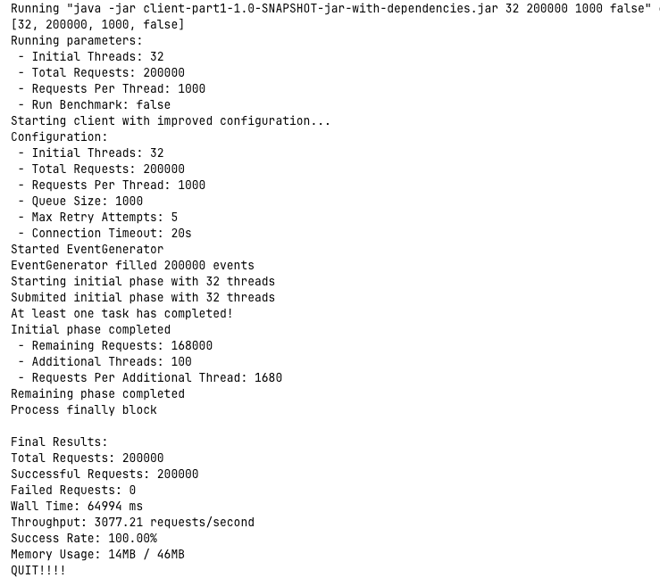
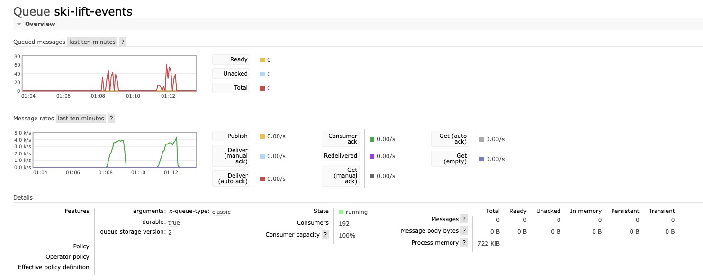

# CS6650 Assignment 2 - Ski Resort Data Processing System Design and Implementation Report

## 1. System Overview

This system is a distributed data collection and processing system developed for Upic ski resorts. It collects data when skiers use lifts, stores it in a message queue, and processes it via a consumer service. The system consists of four main components:

1. **Client** - Generates and sends ski lift event data
2. **Server (Servlet)** - Receives client requests, validates data, and forwards it to the message queue
3. **Message Queue (RabbitMQ)** - Acts as middleware between producer and consumer
4. **Consumer** - Reads data from the queue and processes it

## 2. Project Structure

The system uses a modular design, divided into four major parts: client, server, RabbitMQ middleware, and consumer service. Below is an overview of the key components:

### 2.1 Server Side

```
upic.server
├── SkierServlet.java              # Main servlet handling skier data
├── config
│   ├── RabbitMQConfig.java        # RabbitMQ connection configuration
│   └── ServerConfig.java          # Server global configuration parameters
├── messaging
│   ├── RabbitMQChannelPool.java   # RabbitMQ channel pool management
│   └── RabbitMQPublisher.java     # Message publishing service
└── model
    ├── ErrorResponse.java         # Error response data model
    ├── LiftRideEvent.java         # Lift ride event data model
    └── SuccessResponse.java       # Success response data model
```

### 2.2 Consumer Side

```
upic.consumer
├── CircuitBreaker.java            # Circuit breaker implementation for resilience
├── Main.java                      # Consumer application entry point
├── config
│   ├── CircuitBreakerConfig.java  # Circuit breaker configuration
│   └── RabbitMQConfig.java        # Consumer RabbitMQ configuration
├── messaging
│   └── RabbitMQConsumer.java      # Message consumption processing
└── model
    └── LiftRideEvent.java         # Same data model as server side
```

### 2.3 Client Side

```
upic.client
├── SkiResortClient.java          # Client main class
├── SingleThreadBenchmark.java    # Single-thread benchmark
├── config
│   └── ClientConfig.java         # Client configuration parameters
├── model
│   └── LiftRideEvent.java        # Lift ride event data model
├── producer
│   └── EventGenerator.java       # Random event generator
└── sender
    └── RequestSender.java        # HTTP request sender
```

### 2.4 Load Balancing

The system uses AWS Elastic Load Balancer configured with 4 EC2 instances as server nodes. Additionally, the system includes a separate EC2 instance running RabbitMQ message queue and another EC2 instance running the consumer application.

## 3. Server Design

### 3.1 Architecture

The server component is built using Java Servlet technology, employing asynchronous processing to improve capacity. The main classes include:

- `SkierServlet` - Main entry point, handles HTTP requests, responsible for initialization and configuration
- `RabbitMQPublisher` - Handles interaction with RabbitMQ, sends messages
- `RabbitMQChannelPool` - Manages RabbitMQ channel resources, improves connection reuse efficiency

### 3.2 Data Flow

1. Client sends a POST request to the `/skiers/resorts/{resortId}/seasons/{seasonId}/days/{dayId}/skiers/{skierId}` endpoint
2. The `doPost` method of `SkierServlet` receives the request and initiates asynchronous processing
3. Request parameters undergo comprehensive validation (URL path and JSON data)
4. Upon validation, data is converted to JSON format and sent to the queue via `RabbitMQPublisher`
5. A success response (HTTP 201) is returned to the client

### 3.3 Key Technical Implementations

- **Asynchronous Request Processing**: Uses AsyncContext to improve concurrent processing capability
- **Message Batching**: Collects multiple messages for one-time sending, reducing network overhead
- **Channel Pooling**: Maintains a RabbitMQ channel pool, reducing the overhead of frequent creation and destruction
- **Asynchronous Confirmation Mechanism**: Uses callback functions to handle message confirmations without blocking

## 4. Consumer Design

### 4.1 Key Components

The consumer application is a standalone Java process responsible for reading and processing messages from the RabbitMQ queue. Main components include RabbitMQConsumer, CircuitBreaker, and thread-safe data storage structures.

### 4.2 Core Functions

- **Dynamic Thread Scaling**: Automatically adjusts the number of consumer threads based on queue depth
- **Circuit Breaker Pattern**: Detects consecutive failures and temporarily blocks processing to prevent system cascade failures
- **Performance Monitoring**: Tracks queue depth, processing rate, and memory usage

## 5. Client Design

### 5.1 Architecture

The client consists of SkiResortClient (main class), EventGenerator, RequestSender, and SingleThreadBenchmark (performance testing).

### 5.2 Key Functions

- **Two-Phase Sending Strategy**: Initial phase with 32 threads, followed by a phase handling remaining requests
- **Event Queue Management**: Uses BlockingQueue to transfer data between event generation and request sending
- **HTTP Request Sending**: Uses Java 11 HttpClient, supporting HTTP/2 and connection pooling
- **Error Handling and Retry**: Implements a retry mechanism of up to 5 attempts for server errors

## 6. System Performance Optimization

### 6.1 Key Optimization Techniques

- **Asynchronous Processing**: Uses asynchronous Servlet and thread pools to process requests in parallel
- **Batch Processing**: Message batching mechanism reduces RabbitMQ network round trips
- **Connection Pooling**: Channel pool reduces connection resource creation and destruction overhead
- **Parameter Optimization**: Tuning of key parameters for server and consumer

## 7. Use Guidance
### 7.1 Client
Update BASE_URL in ClientConfig to change server or Loadbalancer address
```
public static final String BASE_URL = System.getProperty("client.baseUrl", "http://CS6650-LB-4server-302525209.us-west-2.elb.amazonaws.com:8080/server-2.0-SNAPSHOT/skiers");
```
### 7.2 Servlet and Consumer
Update HOST in RabbitMQConfig to use the correct RabbitMQ instance address. Also change the port if not using 5672
```
public static final String HOST = System.getProperty("rabbitmq.host", "34.219.55.2");
public static final int PORT = Integer.parseInt(System.getProperty("rabbitmq.port", "5672"));
```

### 7.3 Run client
```
java -jar <path>/client-part1-1.0-SNAPSHOT-jar-with-dependencies.jar <initial thread for stage 1> <total requests> <queue size for statge 1> <run single thread benchmark>
// Usage
java -jar client-part1-1.0-SNAPSHOT-jar-with-dependencies.jar 32 200000 1000 false
```

## 8. Screenshots
### 8.1 Single Server





### 8.2 Load Balanced Performance



