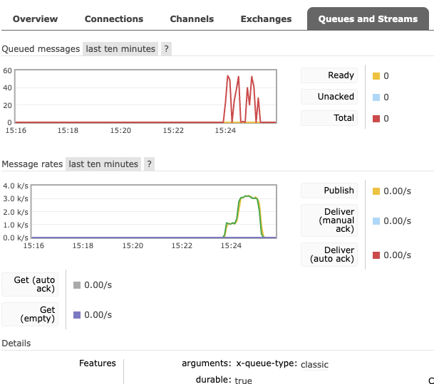
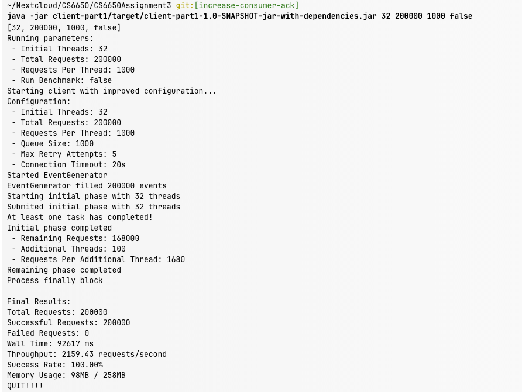
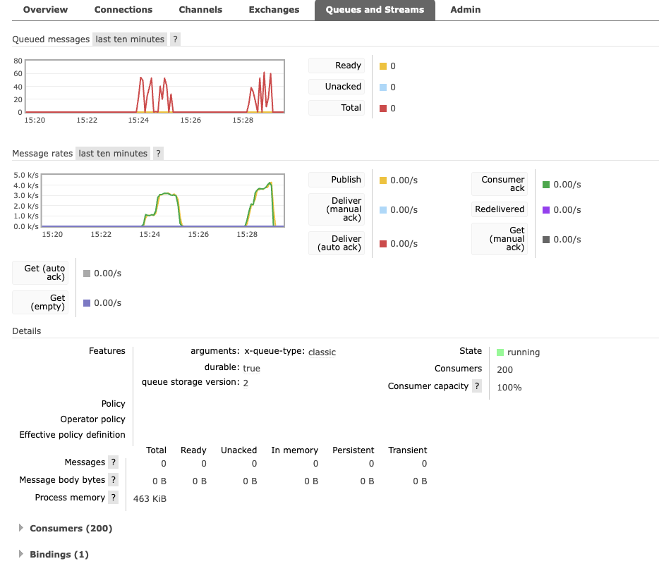
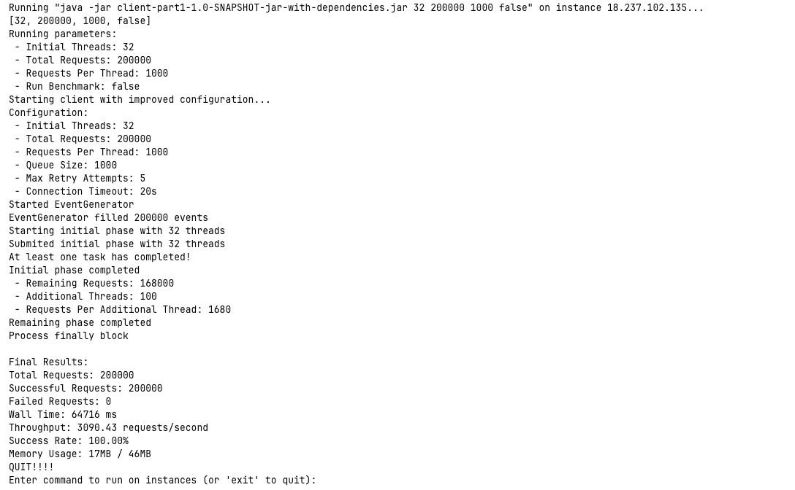
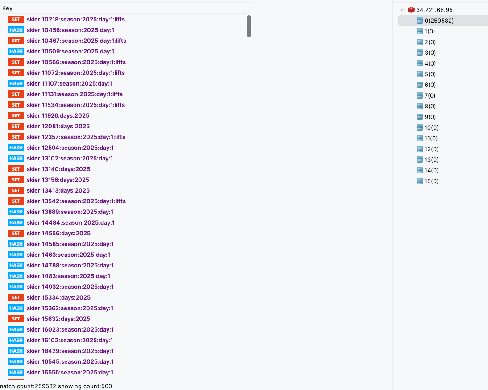
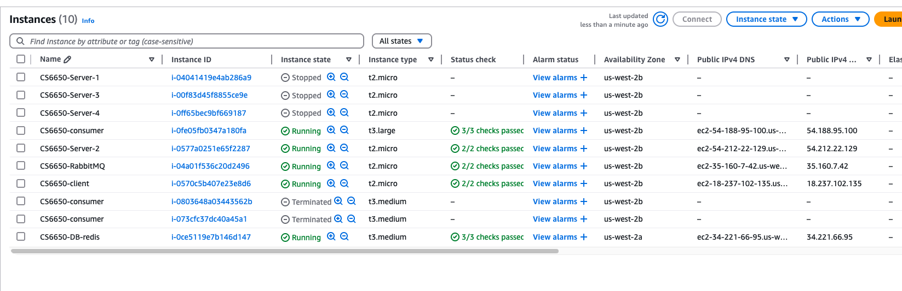

# CS6650 Assignment 3 Submission

## Repository URL
https://github.com/ShqiW/CS6650Assignment3

## Database Design and Deployment Topology

### Database Selection: Redis
For this project, Redis was selected as the database solution based on the following considerations:
- High-performance in-memory data storage, suitable for processing high-throughput ski resort data
- Support for complex data structures (sets, hash tables), meeting query requirements
- Fast read/write operations, reducing message processing latency

### Data Model
The Redis data model was designed as follows to support the required queries:

1. **Skier Day Records**:
    - Key: `skier:{skierId}:season:{seasonId}:day:{dayId}`
    - Type: Hash
    - Fields:
        - `vertical`: Total vertical distance (calculated as liftId * 10)

2. **Skier Daily Lift Records**:
    - Key: `skier:{skierId}:season:{seasonId}:day:{dayId}:lifts`
    - Type: Set
    - Values: Lift IDs ridden by the skier on that day

3. **Season Skiing Days Records**:
    - Key: `skier:{skierId}:days:{seasonId}`
    - Type: Set
    - Values: Day IDs when the skier was active

4. **Resort Visit Records**:
    - Key: `resort:{resortId}:day:{dayId}:season:{seasonId}:skiers`
    - Type: Set
    - Values: Skier IDs who visited the resort on that day

This model efficiently supports the required queries:
- For skier N's ski days in a season: Get the size of the set `skier:{N}:days:{seasonId}`
- For skier N's vertical totals per day: Get the `vertical` field from each day's hash
- For skier N's lifts ridden each day: Get all members of `skier:{N}:season:{seasonId}:day:{dayId}:lifts` for each day
- For unique skiers at resort X on day N: Get the size of the set `resort:{X}:day:{N}:season:{seasonId}:skiers`

### Optimization Techniques
1. **Batch Processing**:
    - Using Redis pipelines for batched commands
    - Implemented batch processing with a size of 500 events
    - Batch flush interval of 50ms

2. **Connection Pool Management**:
    - Using Jedis connection pooling
    - Configured with a maximum of 128 connections
    - Idle connections range from 8 to 32

3. **Circuit Breaker Pattern**:
    - Implemented CircuitBreaker class to enhance system resilience
    - Automatically detects failures and temporarily blocks operations likely to fail
    - Configurable error thresholds and reset timeouts

4. **Asynchronous Data Processing**:
    - Using memory buffer queues (BlockingQueue) to temporarily store pending events
    - Implementing producer-consumer pattern to separate data reception and processing
    - Employing scheduled task executors (ScheduledExecutorService) to manage batch processing cycles
    - Using Pipeline technology to execute multiple Redis commands in a single network round-trip
    - Implementing degradation strategies when write buffers are full

### AWS Deployment Architecture
Based on the screenshots, the system is deployed across multiple EC2 instances on AWS:

1. **Application Server Node** (t2.micro):
    - Instance name: CS6650-Server-2 (running)
    - Hosting Apache Tomcat and Java Servlet
    - IP: 54.212.22.129
    - Handles HTTP requests and validation
    - Uses asynchronous request processing

2. **RabbitMQ Message Queue Server** (t2.micro):
    - Instance name: CS6650-RabbitMQ (running)
    - IP: 35.160.7.42
    - Queue configuration:
        - Durable queue and messages
        - No auto-delete
        - Prefetch count: 500

3. **Redis Database Server** (t3.medium):
    - Instance name: CS6650-DB-redis (running)
    - IP: 34.221.66.95
    - Running Redis database
    - Memory policy: allkeys-lru

4. **Consumer Server** (t3.large):
    - Instance name: CS6650-consumer (running)
    - IP: 54.188.95.100
    - Running RabbitMQ consumer
    - Initial thread count: 200
    - Maximum thread count: 250
    - Batch size: 500

## System Resilience Design

To ensure system stability and reliability under high load, the following resilience designs were implemented:

### Message Queue Management
We employed multiple strategies to maintain stable queue lengths:
1. Implementing batch processing to increase consumer throughput
2. Dynamic thread scaling (adding consumer threads when queue depth exceeds 1000)
3. Using circuit breakers during peak periods

### System Resilience Implementation Mechanisms
To prevent system overload and maintain stability, the following mechanisms were implemented:

1. **Circuit Breaker Pattern**:
    - Message processing circuit: Configured to trigger after 50 consecutive failures
    - Message consumption circuit: Configured to trigger after 5 consecutive failures
    - Providing automatic recovery and exponential backoff

2. **Dynamic Thread Scaling**:
    - Dynamically increasing consumer threads based on queue depth
    - Reducing threads when queue messages are fewer than 100
    - Maintaining optimal resource utilization balance

3. **Degradation Strategies**:
    - Implementing direct processing when batch queues are full
    - Implementing retry mechanisms when Redis connection pools are exhausted
    - Processing all remaining messages during system shutdown

## Detailed Asynchronous Data Processing Design

The system implements an efficient asynchronous data processing pipeline, optimized at every stage from receiving HTTP requests to final persistence in the Redis database:

### 1. Servlet Layer Asynchronous Processing
- Using Servlet 3.0+ asynchronous features (AsyncContext) to process requests
- Implementing non-blocking request processing to improve server concurrency
- Returning to the client immediately after request validation, with background asynchronous data processing
- Configuring dedicated thread pools for asynchronous request processing

### 2. Message Queue Asynchronous Publishing
- Using RabbitMQ Channel pools to improve publishing efficiency
- Implementing message batching, automatically flushing based on size and time intervals
- Adopting Publisher Confirms mode to ensure reliable message delivery
- Buffering pending messages through ConcurrentLinkedQueue

### 3. Consumer Multi-level Asynchronous Processing
- Implementing a two-level buffer system:
    1. **First-level buffer**: RabbitMQ queue, handling speed mismatches between producers and consumers
    2. **Second-level buffer**: In-memory BatchQueue, aggregating messages for batch processing

- Consumer using asynchronous processing architecture:
    1. Multiple threads retrieving messages from RabbitMQ
    2. Adding messages to in-memory batch processing queue
    3. Scheduled task processor batch submitting to Redis

- Implementing adaptive batch processing strategy:
    1. Fixed time interval (50ms) for processing batches
    2. Dynamically adjusting batch size (maximum 500 messages)
    3. Dynamically adjusting consumer thread count based on queue depth changes

### 4. Monitoring and Control of Asynchronous Processing
- Scheduled statistics reporting threads monitoring system performance
- Implementing circuit breaker pattern to prevent system overload
- Graceful shutdown mechanism ensuring all data is processed before system shutdown

This multi-level asynchronous processing architecture performed excellently in testing, efficiently handling client peak loads while maintaining stable operation across all system components.

## Output Screenshot
I tried run client both on local and EC2. Although EC2 has better throughput, the queue length is stable.

### 1. Run client locally

### 2. Run client on EC2

### 3. Database-Redis

### 4. AWS EC2 Dashboard

